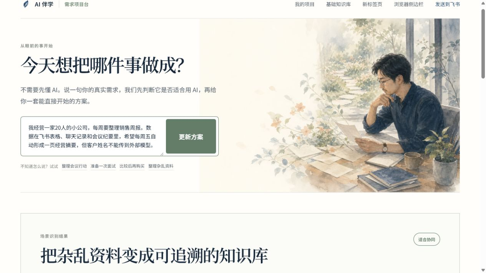
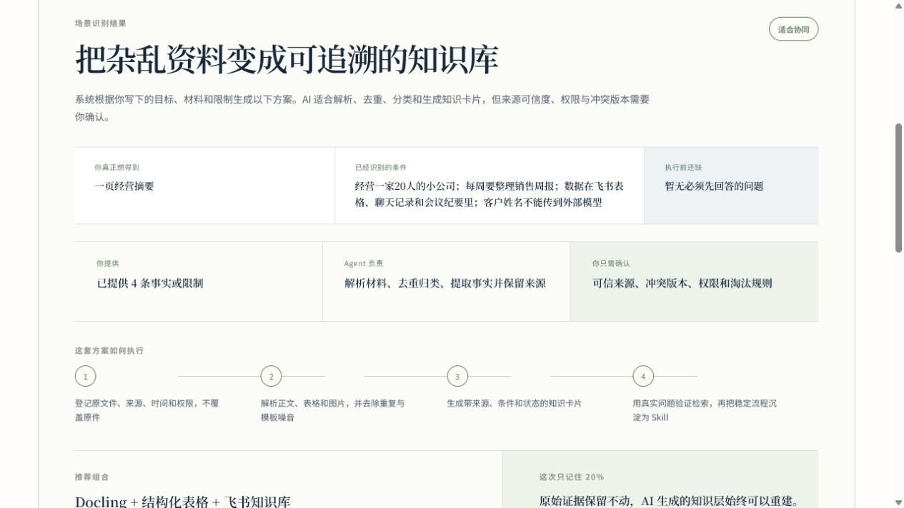
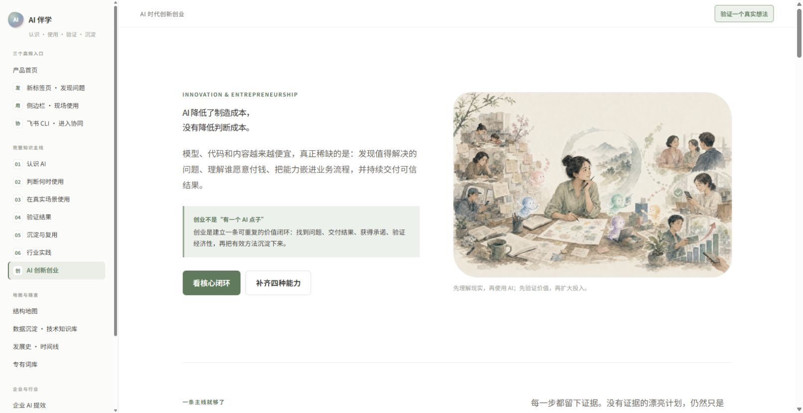

# AI 伴学产品深度自查

日期：2026-07-23

## 结论

项目已经从“内容型网站 Demo”进入“可体验的产品原型”阶段，但还没有成为完整产品。

- 视觉与知识内容：接近可公开使用的 Beta。
- 需求识别与方案生成：可用的 Alpha。
- Agent 项目执行：仍是模板化执行草案，尚未形成真实工具执行闭环。
- 浏览器插件与飞书：具备安装和桥接骨架，但三端没有共享同一个项目状态。
- 后端与数据沉淀：尚未完成账户、持久化、跨端同步、权限、审计和真实 Skill 库。

当前最重要的任务不是继续增加页面，而是建立一条真实的产品数据与执行主线：

`上下文 → 项目 → 证据 → 方案 → Agent Run → 人工确认 → Artifact → Skill → 再次复用`

## 审计流程

### Step 1 · 进入需求项目台

健康度：良好。

优点：

- 第一个问题面向现实任务，而不是要求用户先选择 AI 工具。
- 输入框、场景示例和水彩画风形成清晰的第一视觉层级。
- 桌面端主动作明确，没有把基础知识铺满首屏。

问题：

- “给我具体方案”之后用户仍不知道会得到方案、成果还是实际执行。
- 首屏之后同时出现多个场景卡片，容易把已经有明确需求的人重新拉回浏览模式。
- 产品没有展示数据如何处理、是否上传、会保存多久。

### Step 2 · 输入真实业务需求

健康度：部分可用。

优点：

- 能提取目标、已知条件和隐私限制。
- 页面不再自动滚动，用户仍保有空间位置感。
- 需求识别结果直接出现在首屏之后。

问题：

- 对“每周五自动生成”“飞书多来源”“客户姓名不得外传”仍显示“暂无必须先回答的问题”。
- 推荐 `Docling + 结构化表格` 对非技术用户门槛过高，没有优先给出飞书原生路径。
- 场景识别停留在分类，没有形成动态追问和可验证成功标准。

### Step 3 · 查看执行方案

健康度：结构清楚，内容仍偏模板。

优点：

- 人、Agent 和确认点的职责区分明确。
- 步骤、工具与核心原则形成视觉分组。
- “原始证据保留不动”是正确的数据架构原则。

问题：

- 四个执行步骤与用户的“每周销售经营摘要”联系不够具体。
- 缺少数据源连接状态、样本数据、输出字段和验收标准。
- 10–12px 的辅助文字在桌面截图中已经偏小，全年龄用户尤其需要更高可读性。
- 主要执行按钮位于首屏以下，用户需要继续滚动才能发现。

### Step 4 · 调用 Agent

健康度：Alpha，不应称为完整执行。

接口返回的 `meta.route` 为 `project-agent-local`，成果来自确定性模板。它会生成一份可编辑初稿和确认清单，但不会读取飞书表格、聊天记录和会议纪要，也不会创建自动化、任务或文档。

当前界面容易把“生成执行草案”误解成“Agent 已完成项目”。在接入真实工具前，应显示：

- 使用了哪些输入；
- 哪些步骤真实执行；
- 哪些只是建议；
- 每次工具调用的结果、时间和证据；
- 哪些动作等待人工确认。

### Step 5 · AI 创新创业专题

健康度：内容与视觉完成，已接入知识主线。

内容已形成一条主线：

`真实问题 → 用户访谈 → 价值假设 → 最小实验 → 真实承诺 → 单位经济 → 复盘沉淀`

专题覆盖商业思维、业务能力、产品思维、创新能力，并把 Effectuation、JTBD、Customer Development、Lean Startup、Business Model Canvas 和 Paul Graham 的早期创业原则放在不同问题下使用。

### Step 6 · 手机端

健康度：可用。

优点：

- 水彩图片完整显示，没有水平溢出。
- 阅读顺序为图片、论点、正文，结构稳定。
- 侧边栏默认收起。

风险：

- 页面整体仍然很长，需要专题内的快速目录或阶段折叠。
- 个别长标题在窄屏会形成较多行，需要持续控制字号和行长。

## 最高优先级问题

### P0 · 建立统一项目数据层

目前项目只保存在 `localStorage`，换浏览器、换电脑、进入飞书后无法继续。需要后端数据模型：

- Project：用户想完成的现实目标；
- Context Source：网页、文档、表格、对话及权限；
- Evidence：可追溯事实；
- Plan：可执行步骤；
- Agent Run：每次执行与工具调用；
- Decision：需要人的确认；
- Artifact：最终文档、表格、任务或分析结果；
- Skill：经过验证、可再次复用的流程。

### P0 · 让 Agent 真实执行，并诚实展示执行状态

当前输出是模板化草案。下一阶段至少跑通一个完整用例，例如：

1. 用户选择飞书表格和会议纪要；
2. 系统读取样本并生成销售经营摘要；
3. 用户确认字段、隐私和发送对象；
4. Agent 写入飞书文档；
5. 系统保存引用、运行记录和可复用 Skill。

### P0 · 三个入口共享一个项目

- 新标签页：发现需求、继续最近项目；
- 侧边栏：读取当前页面或选中文字，补充项目证据；
- 飞书：连接组织数据，协作、审批和执行；
- 主站：查看项目、结果、知识与 Skill。

它们不应是三个独立产品，而是同一项目状态的四个入口。

### P0 · API 身份与安全边界

- API 目前没有用户身份或租户隔离。
- 内存限流在 Serverless 冷启动后不可靠。
- CORS 接受任意 `chrome-extension://` 来源，正式发布后应绑定明确扩展 ID。
- 需要数据保留、删除、导出、脱敏和审计策略。

## 第二优先级

### P1 · 从“场景分类”升级为“最少追问”

只追问一个真正影响结果的问题，优先级为：

1. 成功结果；
2. 数据来源与权限；
3. 不可触碰边界；
4. 截止时间；
5. 谁做最终决定。

### P1 · 建立产品级评估体系

核心指标不应是页面浏览量，而应是：

- 首次可用成果时间；
- 方案到真实执行的转化率；
- Artifact 被复制、采用或写入飞书的比例；
- Agent 执行成功率与人工介入率；
- 引用正确率和用户纠错率；
- 7/30 日再次完成现实项目的比例；
- Skill 二次复用率。

### P1 · 收拢知识架构

现在知识量很丰富，但页面数量多、旧内容和项目式主线并存。建议统一到：

1. 认识与边界；
2. 解决现实问题；
3. 验证与交付；
4. 数据沉淀与 Skill；
5. 企业、行业与创新创业专题。

所有旧页面保留，但通过统一元数据、搜索、来源和“当前项目需要它时再打开”进入。

## 第三优先级

### P2 · 可访问性与全年龄阅读

- 正文下限建议 16px，辅助文字尽量不低于 12–13px；
- 检查低对比绿色文字；
- 对所有主流程执行键盘、焦点、200% 缩放和屏幕阅读器测试；
- 移动端为长专题增加锚点目录；
- 动态结果应有明确的 `aria-live` 状态和错误恢复。

### P2 · 工程与发布

- 当前工作树包含大量未提交改动，应拆分为可审阅提交；
- 字符串匹配测试不能替代端到端测试；
- 大幅 PNG 单张约 2.8MB，应生成 WebP/AVIF 响应式版本；
- 多个静态 HTML 页面存在重复结构，内容应逐步数据化；
- 为插件建立打包、版本、权限审计和 Chrome Web Store 校验流程。

## 建议的三阶段路线

### 阶段 A · 一个真实闭环

只做“飞书销售周报 → 一页经营摘要 → 人工确认 → 写回文档 → 保存 Skill”。

### 阶段 B · 统一项目与跨端状态

加入账户、项目数据库、证据与运行记录，让新标签页、侧边栏、主站和飞书继续同一个项目。

### 阶段 C · 扩展场景和行业

在指标证明真实复用后，再扩展会议、购买、求职、客户沟通、数据沉淀、汽车制造与创新创业。
